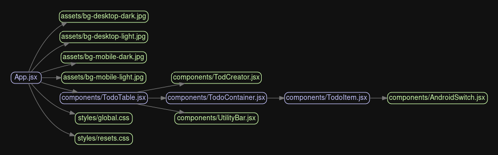

# TODO APP

Your average todo app but with quite a few functionalities added to it, such as :

- Pagination
- Database to handle list items
- Toast for a better user-system communication
- Dark mode

## Table Of Content

- [Acknowledgement](#acknowledgement)
- [Dependency Diagram](#dependency-diagram)
- [Links](#links)
- [Tech used](#tech-used)
- [Todo](#todo)
- [Improvements I could have made](#improvements-i-could-have-made)
- [Known unfixable issues](#known-unfixable-issues)

### Acknowledgement

* [Netlify](https://app.netlify.com/)
* [PlanetScale](https://planetscale.com/)
* [Cyclic.sh](https://www.cyclic.sh/)

### Dependency Diagram

### Links

- [Live Website on Netlify](https://golden-liger-9ba371.netlify.app/)
- [Backend GitLab Repo](https://gitlab.com/Decipher-CS/todo-app-backend-api)

### Tech used

- ReactJS for frontend
- Netlify for hosting frontend
- NodeJS for backend
- ExpressJS for routing
- mySQL as database
- PlanetScale for hosting mySQL database
- Cyclic for hosting backend

### TODO

- [x] Adjust margins for top heading.
- [x] Add a backend to store the todo data
- [x] Add a check if theme and todo exist in the localstorage because if they don't, Page won't load unless refreshed. Look more into this.
- [x] Idea: put a switch on the header to use local storage or remote database according to user preference.
- [x] Don't wait for database on initial load. Show a skeleton instead on the place of all the todo items.
- [x] Add a mui snackbar for when connection with database could not be established.
- [x] Add link to backend in readme and vice versa.
- [x] Put catch blocks on the fetch api throughout the code.
- [x] Add pagination.
  - [x] Pagination shouldn't break filter system. Check if it does.
  - [x] Pagination should auto-switch to the previous page when last item on the current page is deleted.
- [x] Setup corn on the backend.
- [x] Add function to sycn everything with server with a manual button press or with a snackbar prompt asking to do so on data inconsistency.
- [x] MySQL database is the same for every user. Implement different todo items for different useres.
- [ ] Add time and data to the last time a user accessed the server and delete data if user hasn't accessed anything in over X time.
- [x] If connecting to server fails, try after set time.
- [x] Fix bug encountered when item text length exceeds a certain characters.
- [ ] Add tooltip on button group next to top level heading.

### Improvements I could have made

Could have :

- Used useReducer for updating, deleting, adding the todos.
- Used context API to manage props.

### Known unfixable issues

Issues that have come to my attention but will not be fixed for one reason or another.

- The list order will change on refresh due to the database having its own sequence of items.
